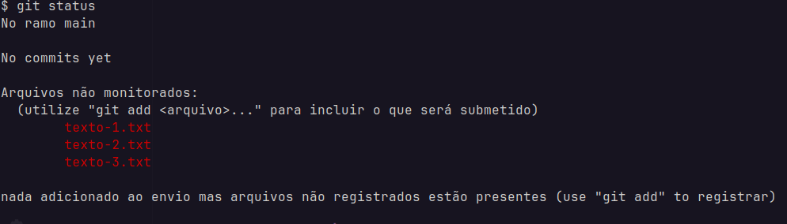

# Aula git

Nesta aula aprenderemos os conceitos básicos de git para controle de versão de um projeto, e como conectá-lo a um repositório remoto no GitHub.

## 1. Instalando o git

A depender do sistema operacional que você está usando o git pode já estar instalado no seu sistema, mesmo assim aqui está a url do site oficial do git que contém as instruções de instalação pra cada sistema: https://git-scm.com/downloads

## 2. Criando o repositório

Para criar um repositório git numa pasta que você deseja controlar a versão basta digitar:
```
git init
```


Agora que temos o repositório git criado podemos verificar o status dele com o comando:

```
git status
```

você deve ver algo como na imagem a seguir:  



## 3. Fazendo nosso primeiro commit

Agora que já temos uma pasta com os arquivos preparados e com o repositório iniciado nós podemos fazer nosso primeiro commit, marcando a primeira versão dos arquivos dessa pasta com o comando:  
```
git commit -m 
```
