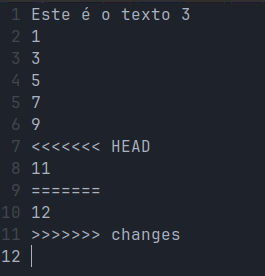
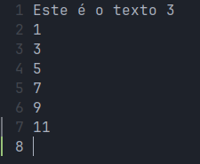
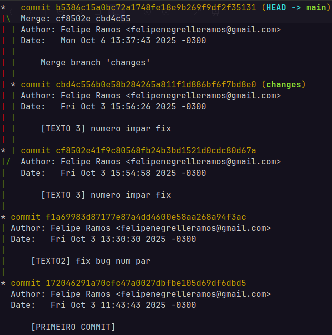
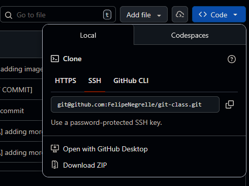

# Aula git

Nesta aula aprenderemos os conceitos básicos de git para controle de versão de um projeto, e como conectá-lo a um repositório remoto no GitHub.

## 1. Preparando o ambiente

A depender do sistema operacional que você está usando o git pode já estar instalado no seu sistema, mesmo assim aqui está a url do site oficial do git que contém as instruções de instalação pra cada sistema: https://git-scm.com/downloads

Após ter instalado a ferramenta vamos configurar nossas informações de usuário com os comandos:

```
git config --global user.email "meu_email@email.com"

git config --global user.name "Meu Nome"
```

Agora é importante termos os arquivos para podermos controlar a versão. Sendo assim iremos baixá-lo da seguinte url: https://felipenegrelle.com.br/files/projeto.zip

Com o arquivo temos de descompactá-lo e acessar esta pasta no terminal.

## 2. Criando o repositório

Para criar um repositório git numa pasta que você deseja controlar a versão basta digitar:
```
git init
```


Agora que temos o repositório git criado podemos verificar o status dele com o comando:

```
git status
```

você deve ver algo como na imagem a seguir:


## 3. Fazendo nosso primeiro commit

Agora que já temos uma pasta com os arquivos preparados e com o repositório iniciado nós podemos fazer nosso primeiro commit, marcando a primeira versão dos arquivos dessa pasta com os comandos:

```
git add --all
```

Com esse comando nós adicionamos todos os arquivos para a área de staging que denota os arquivos que serão adicionados no próximo commit, funcionando como um bastidor ante ao palco.

```
git commit -m "[PRIMEIRO COMMIT]"
```

Após esse comando nós marcamos a primeira versão dos nossos arquivos.

## 4. Entendendo a versão

Tendo o commit feito podemos checar a nossa árvore de commits e como eles estão organizados com o seguinte comando:
```
git log --graph
```

Agora que entendemos como está o estado do repositório podemos passar para outro conceito, o de branches. Uma branch é uma ramificação do estado principal do repositório (a HEAD, ou comumente a branch main), para criar uma branch nós rodando o seguinte comando:
```
git branch changes
```

Com esse comando criamos uma branch chamada "changes", pra visualizar todas as branches que temos no nosso repositório nós rodamos:
```
git branch
```

Tendo a branch nova criada nós podemos mudar o cursor do repositório para estar nessa branch com o comando:

```
git checkout changes
```

A partir dessa ramificação nós vamos fazer o que o nome dela propõe, mudar coisas. Dito isso, vamos mudar o 11 do arquivo para 10 para deixar a sequência de números pares correta, simulando o conserto de um bug numa base de código. Tendo terminado a modificação, nós podemos repetir o processo de commit dos passos anteriores pra poder criar um novo commit.

## 5. Juntando versões

Feitas as modificações na nossa ramificação de mudanças, podemos voltar pra main e fazermos um procedimento muito comum em desenvolvimento de software, o _merge_. Quando fundimos duas ramificações juntas, basicamente pegamos dois históricos separados de versões de código, ou seja dois históricos de commits de branches diferentes, e juntamos o histórico mais recente de uma branch em outra. Com isso podemos, por exemplo, dividir tarefas entre diversos funcionários onde cada um trabalha na sua própria branch e quando a tarefa for concluída é feito o merge para a main e o código incorporado na ramificação principal. Pra fazer isso rodamos o comando:
```
git checkout main
git merge changes
```
Rodando isso nós incorporamos as alterações da changes na main, fazendo com que o código fique atualizado.

## 6. Simulando um conflito

Agora nós iremos simular outro cenário muito comum no mundo do desenvolvimento: um conflito de commits. Geralmente esse tipo de conflito ocorre quando 2 commits mexem no mesmo arquivo e nas mesmas linhas, tentando coexistir na árvore de commits. Quando isso ocorre o git não consegue determinar automaticamente qual versão utilizar como oficial, exigindo confirmação do usuário pra proceder o histórico corretamente. Para simularmos esse conflito vamos primeiramente fazer o checkout para a branch changes e alterar o arquivo texto-3.txt na linha 7 mudando para 12 o seu texto, deixando a sequência incorreta, pra poder simular alguém introduzindo um bug na base por exemplo. Após a modificação utilizamos o procedimento de commit aprendido anteriormente para podermos commitar essa alteração na branch changes, após isso fazemos o checkout para a main e fazemos a alteração da linha 7 para 11, simulando uma conclusão de código. Commitando essa alteração e tentando fazer o merge da changes pra main nós iremos enfrentar um conflito entre essas duas versões.

Por se tratar de um conflito simples é possível nós utilizarmos um editor de texto simples para gerenciarmos esse conflito, mas em casos mais complexos com mais código para editar entre as versões a serem escolhidas é interessante utilizar-se de ferramentas como o próprio VS Code para resolver esses conflitos ou então o Sublime Merge que serve exatamente para esse tipo de tarefa. O conflito que geramos está na imagem abaixo.



Para podermos escolher qual versão vamos deixar como oficial do nosso repositório devemos observar essas delimitações <<<, >>> e === que denotam onde começam e terminam as alterações e suas respectivas marcações dizem de qual commit ou branch que vem. Na imagem notamos a tag HEAD que é a main, nossa branch principal, e nela temos a alteração correta, e na tag da branch changes temos a alteração "bugada" e como queremos que a alteração da main permaneça iremos deixar o código de acordo com a imagem abaixo.



Tendo o conflito resolvido podemos salvar o arquivo, adicionar ele na área de staging com o comando:
```
git add texto-3.txt
```

e depois disso somente rodar ```git commit``` pois o git quando está em merge e os arquivos com conflito já estão na área de staging, o commit padrão de merge é gerado. Com isso podemos observar nossa árvore com ```git log --graph``` e observar o nosso fluxo tal qual a imagem abaixo.

<center></center>

## 7.Conectando a um repositório remoto

Já tendo em mãos os conhecimentos básicos de controle de versão, agora podemos partir pra outra parte muito importante dele, que é onde armazenaremos essas versões do nosso código. Para isso podemos utilizar diversas plataformas como GitHub, GitLabs ou então BitBucket. Para a aula de hoje estaremos fazendo o uso do GitHub uma das mais famosas plataformas de versionamento de código, no momento desta aula, pertencente a Microsoft.

Para podermos conectar o nosso repositório ao GitHub primeiramente precisamos de uma conta criada lá e depois disso se faz necessário criarmos nosso token de acesso na plataforma, encontra-se a página relacionada no link: [Criar Token](https://github.com/settings/tokens). Nessa tela recomendo a criação de um Token clássico para se poder usar em diversos repositórios sem configurações extensivas. Com o token criado e armazenado num local de consulta posterior é útil rodar o seguinte comando para o git memorizar seu token:

```
git config credential.helper store
```

Com esse comando rodado quando nosso token for digitado pela próxima vez, esse helper vai deixá-lo armazenado em `~/.git-credentials` para posterior consulta, para não necessitar digitar toda vez que for feita uma operação com o repositório remoto.

Tendo os tokens em mãos agora podemos partir para o próximo passo: criar o repositório remoto no site, conectarmos nele via git e aí sim subirmos nossos arquivos pra nuvem.

Para fazermos isso podemos ir ao link: [Criar Repositório](https://github.com/new). Na tela, podemos escolher um nome e uma descrição para nosso novo projeto e assim criar ele sem nenhum arquivo adicional.

Com o repositório criado podemos conectar nele indo na opção da imagem abaixo para pegar seu link de conexão:

<center></center>

Agora com essa url, vamos ao nosso repositório e digitamos o seguinte comando:

```
git remote add origin "url do seu repo"
```

Com esse comando adicionamos um novo repositório remoto conectado ao local com o nome origin que segue a url fornecida.

Tendo o remoto configurado podemos efetuar o seguinte comando para mandar o código para o GitHub na ramificação _main_ e já de quebra configurar o origin como _upstream_, que é de certa forma pra onde seus arquivos estão indo por padrão quando realizando operações na nuvem no geral:
```
git push -u origin main
```

É isso! Nós rodamos nosso primeiro envio pra nuvem, e se tudo deu certo, agora nossos arquivos já estão disponíveis no GitHub para todo mundo ver. Não é legal demais da conta?

## 8. Trabalhando em repositórios de terceiros

Um cenário muito comum no desenvolvimento de software é manter repositórios de outrem, nesse caso não faria sentido iniciarmos nosso próprio repositório e tudo mais, nesses casos onde já existe código alocado e nós precisamos dele na nossa máquina nós clonamos esse projeto localmente e trabalhamos com ele a partir disso.

Para testar essas funcionalidades usaremos o comando para clonar o repositório a seguir:
```
git clone "https://github.com/FelipeNegrelle/git-class.git"
```


Com o repositório clonado nós poderíamos agora fazer alterações e fazer commits e pushes tal qual aprendemos nas seções anteriores.

Agora, quando nossos colegas de trabalho no repositório fazem pushes eles não chegam automaticamente no nosso repositório local, pra isso é necessário puxá-los do repositório remoto, que contém a árvore de commits atualizada. Eu farei um commit na aula para todos poderem puxar e ver como o pull funciona. Pra fazer isso nós rodamos o seguinte comando:

```
git pull
```

## Conclusão

Pronto, agora você já tem o básico de git e GitHub pra se virar no dia a dia com desenvolvimento assíncrono, seja na base de código que for.

Dicas: Sempre que precisarem de um comando mais avançado ou alguma ajuda em relação a algum comando dá para rodar um ```git <comando> --help``` pra entrar na página de manual daquele comando e entender melhor o que ele faz, ou as vezes ler sobre uma flag adicional que você pode precisar na sua jornada.